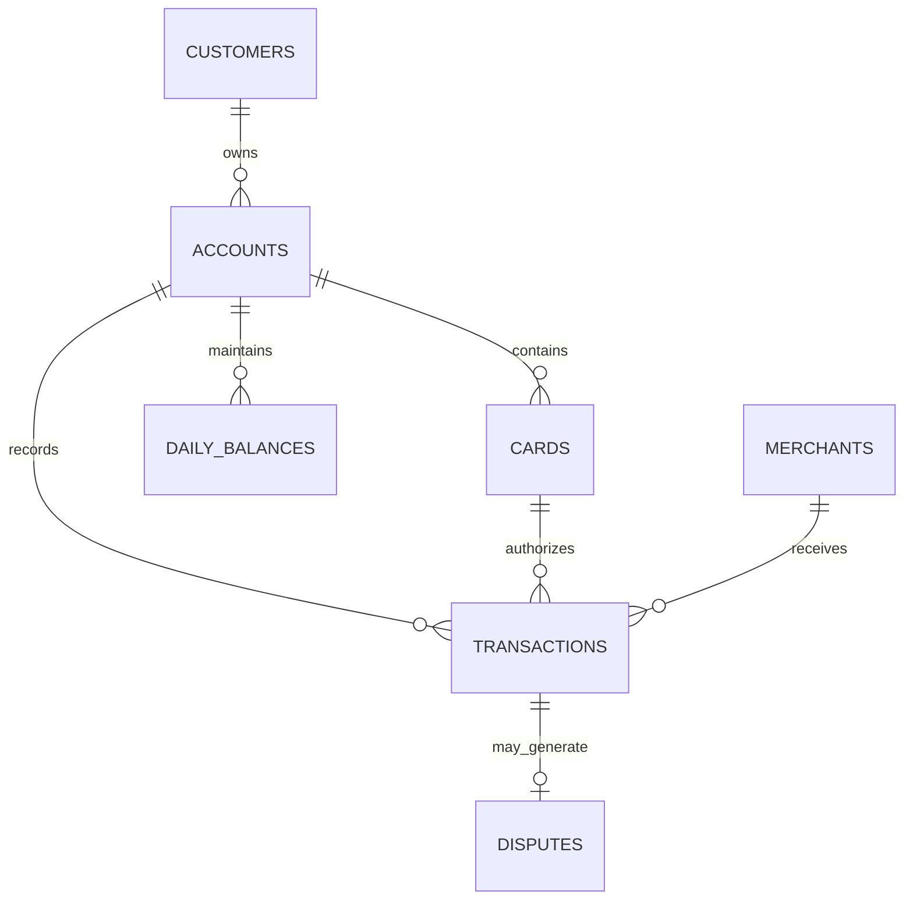

# Source System Design

## Business Context

The source data represents a fictional fintech company that provides customers with digital checking and savings accounts, physical and virtual debit cards, and transaction processing services.

All customer and financial records are synthetically generated. No real customer or financial information is used.

## Source Tables

| Source table | Grain | Primary key |
|---|---|---|
| customers | One row per customer | customer_id |
| accounts | One row per financial account | account_id |
| cards | One row per issued card | card_id |
| merchants | One row per merchant | merchant_id |
| transactions | One row per financial transaction | transaction_id |
| disputes | One row per disputed transaction | dispute_id |
| daily_balances | One row per account per calendar date | account_id, balance_date |

## Entity Relationships

## Customers

One row represents one fintech customer.

| Column | Description |
|---|---|
| customer_id | Unique customer identifier |
| first_name | Synthetic first name |
| last_name | Synthetic last name |
| email | Synthetic email address |
| date_of_birth | Customer date of birth |
| phone_number | Synthetic telephone number |
| street_address | Synthetic street address |
| city | Customer city |
| state | Two-letter US state code |
| postal_code | Customer postal code |
| customer_status | Active, suspended, or closed |
| kyc_status | Pending, verified, or rejected |
| risk_rating | Low, medium, or high |
| created_at | Timestamp when the customer was created |
| updated_at | Timestamp of the most recent customer update |

## Accounts

One row represents one financial account.

| Column | Description |
|---|---|
| account_id | Unique account identifier |
| customer_id | Customer who owns the account |
| account_type | Checking or savings |
| account_tier | Standard or premium |
| account_status | Active, frozen, or closed |
| currency | Account currency, initially USD |
| opened_at | Account opening timestamp |
| closed_at | Account closing timestamp, when applicable |
| overdraft_enabled | Whether overdraft protection is enabled |
| created_at | Record creation timestamp |
| updated_at | Most recent update timestamp |

## Cards

One row represents one physical or virtual card.

| Column | Description |
|---|---|
| card_id | Unique card identifier |
| account_id | Account connected to the card |
| card_type | Physical or virtual |
| card_network | Visa or Mastercard |
| card_status | Active, blocked, expired, or cancelled |
| last_four | Synthetic final four digits |
| issued_at | Card issue date |
| expires_at | Card expiration date |
| daily_limit | Maximum daily transaction amount |
| created_at | Record creation timestamp |
| updated_at | Most recent update timestamp |

Full card numbers and security codes will not be generated.

## Merchants

One row represents one merchant.

| Column | Description |
|---|---|
| merchant_id | Unique merchant identifier |
| merchant_name | Synthetic merchant name |
| merchant_category_code | Four-digit merchant category code |
| merchant_category | Human-readable merchant category |
| city | Merchant city |
| state | Merchant state |
| country | Merchant country |
| online_flag | Whether the merchant operates online |
| risk_level | Low, medium, or high |
| created_at | Record creation timestamp |
| updated_at | Most recent update timestamp |

## Transactions

One row represents one financial transaction.

| Column | Description |
|---|---|
| transaction_id | Unique transaction identifier |
| account_id | Account affected by the transaction |
| card_id | Card used, when applicable |
| merchant_id | Merchant involved, when applicable |
| transaction_timestamp | Timestamp when the transaction occurred |
| transaction_type | Purchase, refund, ATM withdrawal, transfer, or fee |
| transaction_direction | Debit or credit |
| channel | Point of sale, ecommerce, mobile, ATM, or bank transfer |
| amount | Positive transaction amount |
| currency | Transaction currency |
| transaction_status | Approved, declined, pending, or reversed |
| decline_reason | Reason for a declined transaction |
| interchange_fee | Revenue earned from eligible card transactions |
| fraud_flag | Whether the transaction was flagged as suspicious |
| created_at | Record creation timestamp |

## Disputes

One row represents one dispute against a transaction.

| Column | Description |
|---|---|
| dispute_id | Unique dispute identifier |
| transaction_id | Transaction being disputed |
| opened_at | Dispute opening timestamp |
| dispute_reason | Fraud, duplicate, product issue, or service issue |
| disputed_amount | Amount challenged by the customer |
| dispute_status | Open, under review, won, lost, or withdrawn |
| resolved_at | Resolution timestamp, when applicable |
| resolution_amount | Amount returned to the customer |
| created_at | Record creation timestamp |
| updated_at | Most recent update timestamp |

## Daily Balances

One row represents the balance of one account on one calendar date.

| Column | Description |
|---|---|
| balance_date | Calendar date |
| account_id | Financial account |
| opening_balance | Balance at the start of the day |
| total_credits | Total approved credits during the day |
| total_debits | Total approved debits during the day |
| closing_balance | Balance at the end of the day |
| available_balance | Balance available after holds and restrictions |
| created_at | Record creation timestamp |

## Business Rules

1. Every account must belong to one valid customer.
2. Every card must belong to one valid account.
3. A customer may own multiple accounts.
4. An account may have multiple cards.
5. Transaction amounts must be positive.
6. Declined transactions must contain a decline reason.
7. Approved transactions must not contain a decline reason.
8. Interchange revenue applies only to approved card purchases.
9. A transaction may have no more than one dispute.
10. A dispute amount cannot exceed its transaction amount.
11. A resolved dispute must have a resolution timestamp.
12. Daily closing balance equals opening balance plus credits minus debits.
13. The following day's opening balance must equal the previous day's closing balance.
14. Full card numbers and security codes must never be generated.